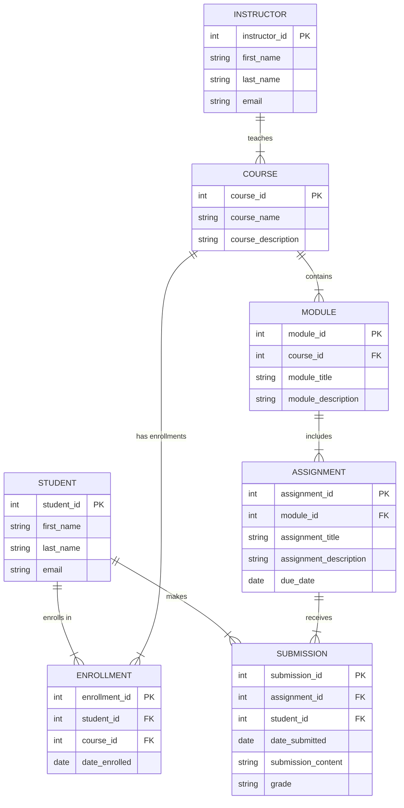
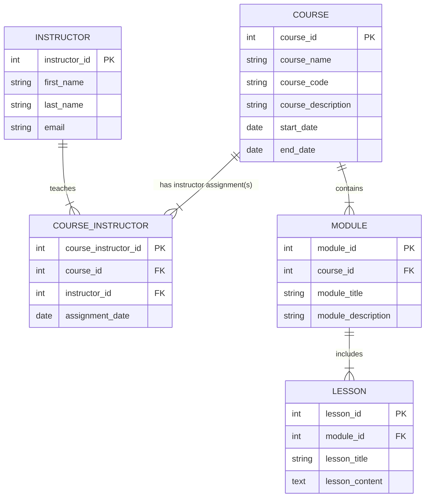
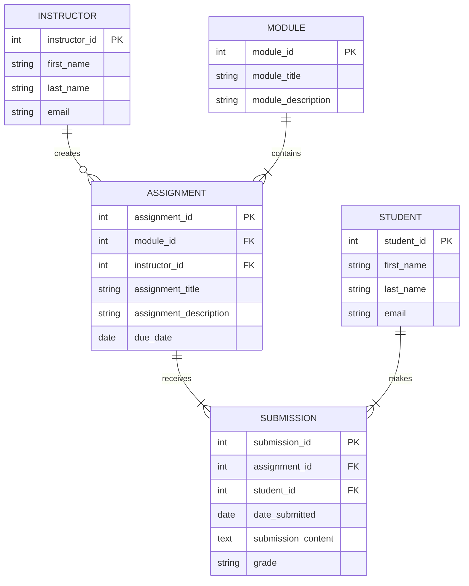

# Entity Relationship Diagram

## ER Diagram of the global LMS database

```mermaid
erDiagram
    STUDENT ||--|{ ENROLLMENT : "enrolls in"
    COURSE ||--|{ ENROLLMENT : "has enrollments"
    INSTRUCTOR ||--|{ COURSE : "teaches"
    COURSE ||--|{ MODULE : "contains"
    MODULE ||--|{ ASSIGNMENT : "includes"
    STUDENT ||--|{ SUBMISSION : "makes"
    ASSIGNMENT ||--|{ SUBMISSION : "receives"

    %% Entity Definitions (Columns)

    STUDENT {
        int student_id PK
        string first_name
        string last_name
        string email
    }

    INSTRUCTOR {
        int instructor_id PK
        string first_name
        string last_name
        string email
    }

    COURSE {
        int course_id PK
        string course_name
        string course_description
    }

    MODULE {
        int module_id PK
        int course_id FK
        string module_title
        string module_description
    }

    ASSIGNMENT {
        int assignment_id PK
        int module_id FK
        string assignment_title
        string assignment_description
        date due_date
    }

    ENROLLMENT {
        int enrollment_id PK
        int student_id FK
        int course_id FK
        date date_enrolled
    }

    SUBMISSION {
        int submission_id PK
        int assignment_id FK
        int student_id FK
        date date_submitted
        string submission_content
        string grade
    }
```

## Course Module ER Diagram

```mermaid
erDiagram
    %% Relationships
    COURSE ||--|{ COURSE_INSTRUCTOR : "has instructor assignment(s)"
    INSTRUCTOR ||--|{ COURSE_INSTRUCTOR : "teaches"
    COURSE ||--|{ MODULE : "contains"
    MODULE ||--|{ LESSON : "includes"

    %% Entities and attributes
    COURSE {
        int course_id PK
        string course_name
        string course_code
        string course_description
        date start_date
        date end_date
    }

    COURSE_INSTRUCTOR {
        int course_instructor_id PK
        int course_id FK
        int instructor_id FK
        date assignment_date
    }

    INSTRUCTOR {
        int instructor_id PK
        string first_name
        string last_name
        string email
    }

    MODULE {
        int module_id PK
        int course_id FK
        string module_title
        string module_description
    }

    LESSON {
        int lesson_id PK
        int module_id FK
        string lesson_title
        text lesson_content
    }
```

## Course Assignment ER Diagram

```mermaid
erDiagram
    %% Relationships
    INSTRUCTOR ||--o{ ASSIGNMENT : "creates"
    MODULE ||--|{ ASSIGNMENT : "contains"
    ASSIGNMENT ||--|{ SUBMISSION : "receives"
    STUDENT ||--|{ SUBMISSION : "makes"

    %% Entities and attributes
    INSTRUCTOR {
        int instructor_id PK
        string first_name
        string last_name
        string email
    }

    MODULE {
        int module_id PK
        string module_title
        string module_description
    }

    ASSIGNMENT {
        int assignment_id PK
        int module_id FK
        int instructor_id FK
        string assignment_title
        string assignment_description
        date due_date
    }

    SUBMISSION {
        int submission_id PK
        int assignment_id FK
        int student_id FK
        date date_submitted
        text submission_content
        string grade
    }

    STUDENT {
        int student_id PK
        string first_name
        string last_name
        string email
    }
```