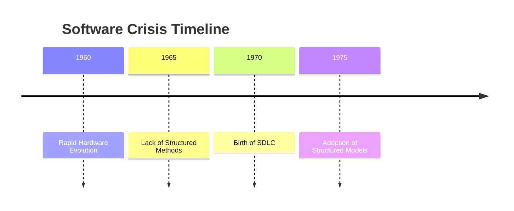
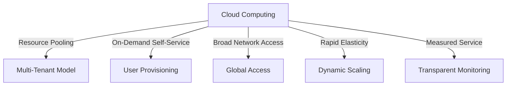
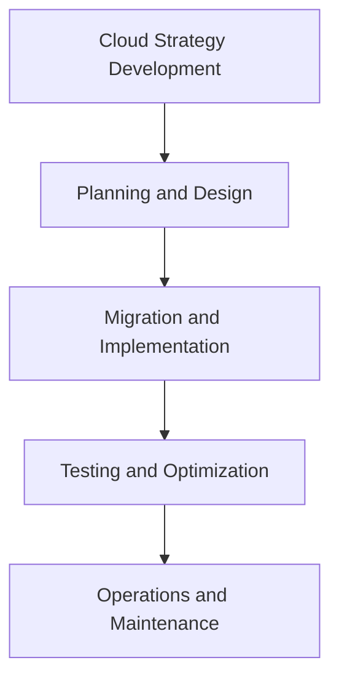
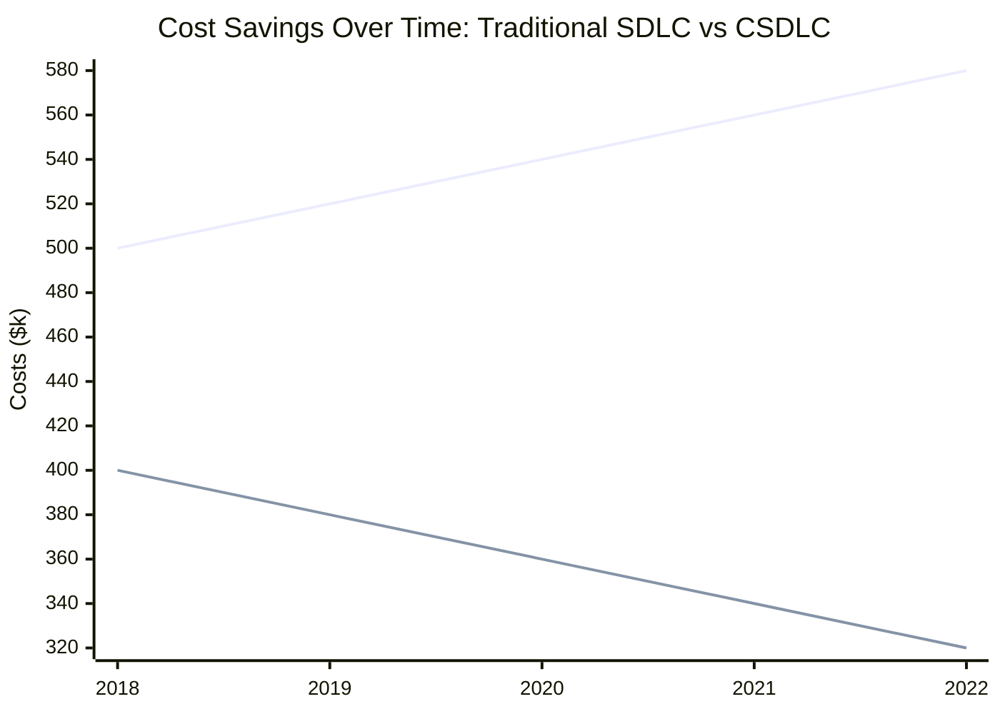

---
# Cloud Computing & Secure Software Development Lifecycle (SDLC)

---

### Evolution of the Software Development Life Cycle (SDLC) and the Role of Cloud Computing

---

## 🌟 The Software Crisis: A Turning Point
By [The God Marco](https://github.com/Marcjazz)

---

### Origins of the Crisis

- 1960s–70s: Rapid hardware growth, insufficient methodologies
- Budget overruns, missed deadlines, incomplete products

---

### Software Crisis Timeline

---

### Causes of the Crisis

- **Hardware Evolution**: Complexity outpaced developers
- **Inefficient Processes**: Chaotic workflows
- **Inadequate Testing**: Poorly functioning products
- **Communication Gaps**: Misaligned user expectations

---

### Resolution and SDLC

- Adoption of structured methods
- Clear project roadmap
- Efficiency and alignment with user needs

---

## ☁️ The Advent of Cloud Computing

---

### Historical Context

- **1950s**: Time-sharing systems
- **1970s**: Virtual machines
- **1990s**: Network services and modern cloud platforms

---

### Why Cloud Computing?

- **Cost Efficiency**: Minimized hardware expenses
- **Scalability**: Dynamic resource scaling
- **Flexibility**: Global access
- **Performance**: Managed infrastructures

---

### Example

**Company X**: AWS migration → 40% cost reduction, auto-scaling, 99.9% uptime

---

## 🛠️ How Cloud Computing Works

---

### Key Principles

---

### Key Concepts

- **Resource Pooling**: Shared resources, data isolation
- **Self-Service**: User-managed provisioning
- **Broad Access**: Internet-based services
- **Elasticity**: Scalable resources
- **Measured Service**: Transparent monitoring

---

## 🔄 Evolution of SDLC with Cloud Computing

---

### Key Phases

---

### Phases Summary

1. Strategy: Align goals with cloud
2. Design: Scalable, cost-effective plans
3. Migration: Automation for efficiency
4. Testing: Robust cloud-based tools
5. Maintenance: Monitoring and updates

---

## 🌐 Impact of Cloud Computing on SDLC

---

### Enhancements

- **Speed**: Faster dev and deployment
- **Collaboration**: Seamless teamwork
- **Cost Savings**: Pay-as-you-go
- **Flexibility**: Wide toolsets
- **Real-Time Updates**: CI/CD pipelines

---

### Example

**Bank**: Azure DevOps → 50% faster deployment, real-time updates

---

### Financial Impact

---

## 🌟 Takeaways: Modern SDLC

---

### Key Points

- SDLC now integrates cloud computing
- Benefits: Scalability, cost-efficiency, user-centricity

---

## 🚀 Next Steps

---

### Practical Actions

- Select cloud models: IaaS, PaaS, SaaS
- Explore deployment: Public, private, hybrid
- Build migration roadmap

