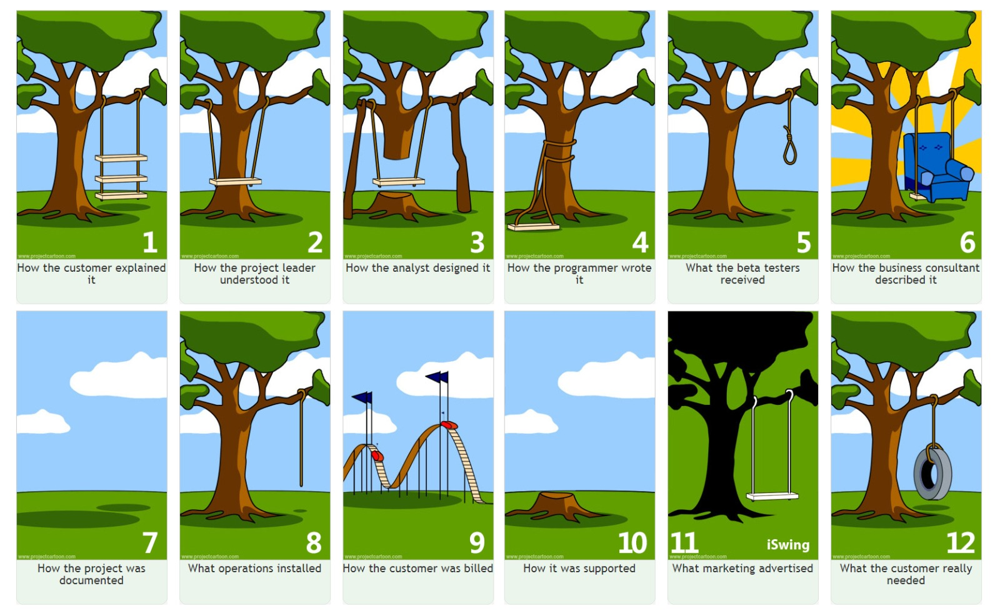

# Sofware Development Life cycle and Cloud: Real-World examples
### **Real-World Example: The "Arab Telephone" Game**

In project management, miscommunication during the **Requirement Gathering and Analysis** phase can lead to drastic deviations in the end product. This is analogous to the **"Arab Telephone" game**, where a message gets passed down a chain, and by the time it reaches the last person, it has morphed into something entirely different. 

For example:
- The client requests a **"simple system to schedule appointments"**, but by the time the requirements are communicated across teams, the developers might interpret it as a **"fully integrated platform with AI capabilities."**
- Result? The delivered software is either too complicated or entirely unsuitable for the client's actual needs.

This highlights why structured SDLC phases ensure clarity and alignment at every step.

---

### **Project Described as a Tree**

This analogy humorously illustrates how stakeholders perceive a project at different stages, often leading to misalignment:

1. **Client’s Original Idea**: The client imagines a simple swing tied to a branch.
2. **Requirement Gathering**: Miscommunication leads the team to design a complex swing with multiple seats.
3. **Design Phase**: The architects sketch a sophisticated machine-like contraption with pulleys and motors.
4. **Development Phase**: The developers build a swing with a tire and a wobbly rope.
5. **Testing Phase**: The swing breaks after one use because the weight capacity wasn’t tested.
6. **Deployment**: The swing is delivered, but it’s mounted upside down on the tree.

Each phase failing to follow a systematic approach results in chaos. This is why SDLC ensures no phase is skipped or inadequately handled.

---

### **Analogy with a Pizza Order**

This analogy further simplifies SDLC through the relatable process of ordering and preparing a pizza:

1. **Requirement Gathering**: You decide you want pizza. You consider your preferences—vegetarian, extra cheese, specific toppings, etc.
2. **System Design**: You visualize the pizza's structure—a crust base, sauce, cheese, toppings in an order.
3. **Implementation**: The chef prepares the pizza according to your specification.
4. **Testing**: Before serving, the pizza is checked for appearance and quality (is the cheese melted, crust evenly cooked?).
5. **Deployment**: The pizza is delivered to your table or doorstep.
6. **Maintenance**: If the pizza arrives cold, it might need reheating, or if you run out of hot sauce, you may need an extra serving.

Each step mirrors the SDLC stages, ensuring the final product meets the customer’s expectations.

To show how the **Software Development Life Cycle (SDLC)** and modern **cloud components** resolve common issues like miscommunication, misalignment, and inefficiencies, let's analyze these examples further with practical solutions from each SDLC phase and cloud technologies.

---

## Real-World Case Study
### **Case 1: The "Arab Telephone" Problem**

#### The Issue:
- Requirements are misunderstood as they are relayed between stakeholders, project managers, and development teams.
- The client’s vision differs significantly from the final software product.

#### How SDLC Solves It:
1. **Requirement Gathering and Analysis**: 
   - Use **collaborative cloud tools** like **Jira**, **Confluence**, or **Google Workspace** to document, share, and centralize requirements. This ensures all stakeholders have visibility.
   - Conduct workshops and employ visual aids like **wireframes** or **mockups** created in tools like **Figma** to verify requirements early.

2. **Design Phase**:
   - Developers use cloud-based **prototyping tools** like **Lucidchart** or **Draw.io** to create system architecture diagrams that are accessible to all.

3. **Testing Phase**:
   - Implement **user acceptance testing (UAT)** on cloud platforms like **AWS Device Farm** or **BrowserStack**, allowing the client to validate the software on various devices and environments before deployment.

4. **Deployment Phase**:
   - Use CI/CD pipelines (e.g., **GitHub Actions** or **GitLab CI**) hosted on cloud platforms to ensure smooth updates and alignment with client requirements.

#### Cloud Components:
- **AWS Lambda**: Provides a scalable way to implement new features quickly without impacting existing services.
- **Google Drive/Docs**: Simplifies requirement documentation and sharing.
- **Azure DevOps**: Manages and tracks all phases with built-in collaboration tools.

---

### **Case 2: The Tree Swing Project**

#### The Issue:
- Each team interprets the project differently, resulting in a misaligned product that doesn't meet the client’s needs.

#### How SDLC Solves It:
1. **Requirement Gathering and Analysis**:
   - Establish clear goals using **collaboration platforms** like **Slack** or **Microsoft Teams** integrated with project management tools like **Monday.com**.
   - Conduct iterative reviews and involve clients in cloud-hosted workshops using **Zoom** or **Google Meet**.

2. **Design Phase**:
   - Use cloud-based design software such as **Adobe XD** or **Sketch** to create **interactive prototypes**, allowing clients to test and provide feedback before coding starts.

3. **Testing Phase**:
   - Cloud testing environments (e.g., **AWS CodePipeline** or **Azure Test Plans**) allow teams to simulate real-world scenarios and ensure the product aligns with specifications.

4. **Deployment Phase**:
   - Deploy the final product via cloud platforms like **AWS Elastic Beanstalk** or **Heroku**, ensuring scalability and reliability.

#### Cloud Components:
- **Amazon S3**: Stores shared assets like design files, ensuring all teams work with the latest versions.
- **Kubernetes**: Manages containerized applications, making it easier to update the product incrementally.

---

### **Case 3: The Pizza Order Analogy**

#### The Issue:
- Customers receive pizzas that don’t match their preferences (e.g., wrong toppings, overcooked crust) due to errors in communication or execution.

#### How SDLC Solves It:
1. **Requirement Gathering and Analysis**:
   - Use **online order forms** (e.g., **Google Forms**, **Typeform**) hosted on the cloud to gather specific customer preferences and constraints.

2. **Design Phase**:
   - Create dynamic menus on platforms like **AWS AppSync**, allowing customers to visualize their pizza as they select toppings.
   - Cloud-hosted tools like **Adobe InDesign** ensure the menu designs match branding and customer expectations.

3. **Implementation (Coding)**:
   - Use **API Gateway** to manage communication between the customer interface and backend systems, reducing the chance of errors in order processing.

4. **Testing Phase**:
   - Simulate high order volumes using **AWS Load Balancer** to ensure the system can handle peak traffic without issues.

5. **Deployment Phase**:
   - Deploy pizza-tracking systems on **Google Cloud** or **Azure**, enabling customers to track order status.

6. **Maintenance**:
   - Use **AWS CloudWatch** or **Datadog** to monitor system performance, making adjustments based on feedback (e.g., improving response times for order status updates).

#### Cloud Components:
- **API Gateway**: Ensures seamless communication between customer-facing applications and backend services.
- **AWS Lambda**: Handles event-driven operations like topping selection or dynamic pricing updates.

---

### **Conclusion: Resolving Issues Using SDLC and Cloud Tools**

By integrating SDLC with cloud components, these issues are systematically resolved. SDLC ensures:
1. **Clear Requirements**: Through collaborative tools and iterative feedback.
2. **Accurate Design**: Prototypes, architecture diagrams, and mockups validate alignment.
3. **Efficient Implementation**: Scalable cloud platforms reduce risks and enable seamless collaboration.
4. **Rigorous Testing**: Cloud-based testing tools ensure quality under diverse conditions.
5. **Smooth Deployment**: CI/CD pipelines streamline rollouts with minimal disruption.
6. **Ongoing Maintenance**: Monitoring tools enable real-time adjustments to meet changing needs.

---

### **Key Cloud Components in SDLC**

| SDLC Phase            | Key Cloud Components                    | Role                                              |
|-----------------------|-----------------------------------------|--------------------------------------------------|
| Requirement Analysis  | Google Workspace, Slack, Zoom           | Collect and clarify requirements collaboratively. |
| Design                | Figma, Lucidchart, Adobe XD            | Create shareable prototypes and diagrams.        |
| Implementation        | GitHub Actions, AWS Lambda             | Automate and execute scalable code deployments.  |
| Testing               | BrowserStack, AWS Device Farm          | Simulate real-world testing scenarios.           |
| Deployment            | AWS Elastic Beanstalk, Heroku          | Enable reliable, scalable deployments.           |
| Maintenance           | Datadog, AWS CloudWatch                | Monitor performance and implement improvements.  |

---

### Final Thoughts

The SDLC combined with cloud technologies ensures efficient, transparent, and collaborative development processes. These tools bridge communication gaps, prevent misalignments, and adapt to customer feedback, delivering high-quality solutions tailored to users’ needs.

---

### **Conclusion**

By employing the **SDLC methodology**, organizations ensure that each phase of software development is approached methodically, minimizing risks, clarifying communication, and delivering quality results. Through humorous analogies like sandwiches, pizzas, and the tree swing, it becomes evident how critical it is to adhere to this structured approach, even in everyday tasks.

