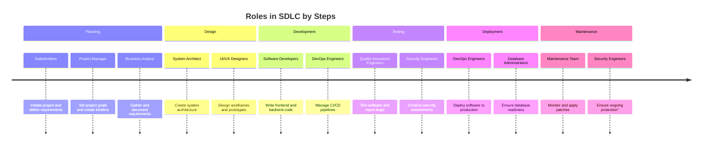

# **Roles and Responsibilities in the Software Development Life Cycle (SDLC)**

The Software Development Life Cycle (SDLC) ensures a systematic approach to software development, breaking it into structured phases such as planning, design, development, testing, deployment, and maintenance. Each phase is supported by individuals or teams with unique roles, ensuring the project progresses smoothly and meets business objectives.

---

## 🧑‍💼 **1. Stakeholders: Visionaries of the Project**

### Overview

Stakeholders are individuals or groups who define the purpose of the software, provide high-level requirements, and oversee its alignment with business goals. This group may include clients, end-users, investors, or internal business leaders.

### Key Responsibilities

- Define and communicate initial requirements and expectations.
- Approve major deliverables such as prototypes or the final product.
- Provide feedback throughout the development process to guide iterations.

### Case Study

In a custom CRM project for a retail company, stakeholders outlined their need for features such as inventory management, customer segmentation, and automated marketing campaigns. Their feedback on the prototype led to improved dashboard usability.

---

## 🕒 **2. Project Manager: The Coordinator**

### Overview

The Project Manager (PM) plans, organizes, and oversees the project lifecycle, ensuring it adheres to schedules, budgets, and stakeholder goals.

### Key Responsibilities

- Develop project timelines and monitor progress against milestones.
- Allocate resources, manage risks, and resolve bottlenecks.
- Act as the central point of communication between teams.

### Case Study

For a healthcare app project, the PM used Agile methodologies, breaking the project into sprints. They facilitated daily stand-ups to ensure consistent progress and quick issue resolution.

---

## 🔍 **3. Business Analyst (BA): The Requirements Bridge**

### Overview

The BA translates business goals into actionable technical requirements, acting as a mediator between stakeholders and the technical team.

### Key Responsibilities

- Gather, analyze, and document business requirements.
- Create workflows, use cases, and functional/non-functional specifications.
- Validate that the final product meets business needs.

### Case Study

In developing an HR management tool, the BA conducted interviews with HR managers to identify pain points, such as manual payroll processing. They documented user stories to prioritize features like automated payroll and employee self-service portals.

---

## 🛠️ **4. System Architect: The Technical Visionary**

### Overview

System Architects focus on designing the high-level structure of the software, including integration points, scalability, and maintainability.

### Key Responsibilities

- Create architectural diagrams and define software frameworks.
- Ensure technical feasibility and oversee design documentation.
- Collaborate with developers to resolve design challenges.

### Case Study

For a logistics management system, the System Architect designed a microservices architecture to ensure scalability as the client expanded operations across multiple regions.

---

## 👨‍💻 **5. Software Developers: The Builders**

### Overview

Developers write and maintain the codebase. Depending on their focus, they specialize in frontend, backend, or full-stack development.

### Key Responsibilities

- Frontend Developers: Build interfaces and implement user interactions.
- Backend Developers: Design server logic, databases, and APIs.
- Full Stack Developers: Integrate frontend and backend components.

### Case Study

In a fitness tracking app, the frontend team used React Native for cross-platform compatibility, while backend developers created an API for real-time data syncing.

---

## 🧪 **6. Quality Assurance (QA) Engineers: Guardians of Quality**

### Overview

QA engineers ensure the software is bug-free and meets performance standards through manual and automated testing.

### Key Responsibilities

- Develop test plans, cases, and scripts for various scenarios.
- Conduct stress, integration, and regression testing.
- Report bugs and verify fixes before release.

### Case Study

For an e-commerce platform, QA engineers tested scalability under heavy traffic during a holiday sale, ensuring the checkout process remained stable under load.

---

## 🎨 **7. UI/UX Designers: Masters of Usability**

### Overview

UI/UX Designers focus on creating user-friendly interfaces and enhancing user satisfaction.

### Key Responsibilities

- Conduct user research and testing to understand pain points.
- Design wireframes, mockups, and prototypes.
- Ensure visual and functional consistency.

### Case Study

In developing a ride-sharing app, UI/UX Designers simplified the booking process into three taps. They also added accessibility features for visually impaired users.

---

## ☁️ **8. DevOps Engineers: Deployment Experts**

### Overview

DevOps Engineers bridge development and operations, ensuring seamless code deployment and system stability.

### Key Responsibilities

- Configure CI/CD pipelines for automated build and deployment.
- Manage cloud resources and monitor performance.
- Implement tools to support development workflows.

### Case Study

For a music streaming platform, DevOps Engineers set up CI/CD pipelines with Jenkins and Docker, enabling frequent feature updates without downtime.

---

## 💾 **9. Database Administrator (DBA): Data Custodians**

### Overview

DBAs design, manage, and optimize databases to ensure data reliability, performance, and security.

### Key Responsibilities

- Design schemas and optimize database performance.
- Perform backups and recover lost data when necessary.
- Monitor and improve database query efficiency.

### Case Study

A retail analytics platform relied on DBAs to handle large datasets efficiently, ensuring query times remained under two seconds even as data grew exponentially.

---

## 🛡️ **10. Security Engineers: Protectors of Systems**

### Overview

Security Engineers ensure the software is safeguarded against threats by identifying and addressing vulnerabilities.

### Key Responsibilities

- Conduct penetration testing and code reviews for security flaws.
- Implement encryption, authentication, and access control mechanisms.
- Monitor security incidents and respond proactively.

### Case Study

A financial app was secured by encryption protocols and multi-factor authentication (MFA) after the Security Engineer identified risks during penetration tests.

---

## 🔧 **11. Maintenance Team: The Sustainers**

### Overview

After deployment, the Maintenance Team ensures the software remains functional and evolves to meet future needs.

### Key Responsibilities

- Monitor the system to identify and resolve issues.
- Apply software updates, patches, and enhancements.
- Adapt the system to changes in user requirements or technologies.

### Case Study

For a tax filing platform, the Maintenance Team ensured compliance with updated tax laws by regularly rolling out updates before tax season.

---

## Diagram

Here's a timeline diagram grouping SDLC roles by their respective steps:

## **Conclusion**

Each role in the SDLC plays a critical part in delivering a successful software product. From stakeholders defining the vision to developers building the code and maintenance teams ensuring long-term stability, the collaboration ensures both quality and usability. Case studies across various industries highlight the practical application of these roles, showcasing their importance in meeting diverse challenges.
