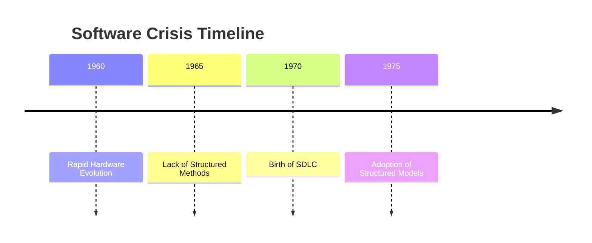
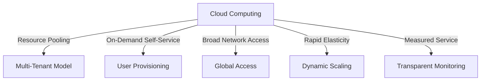
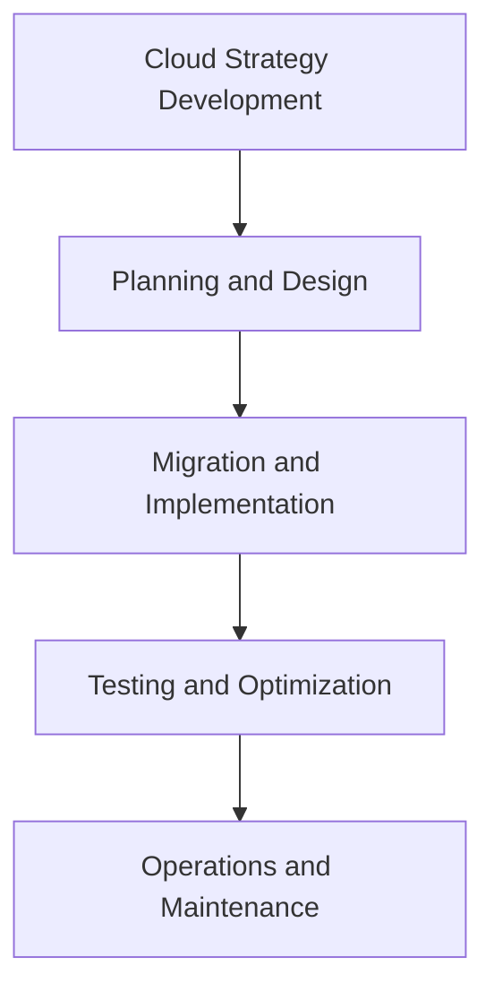
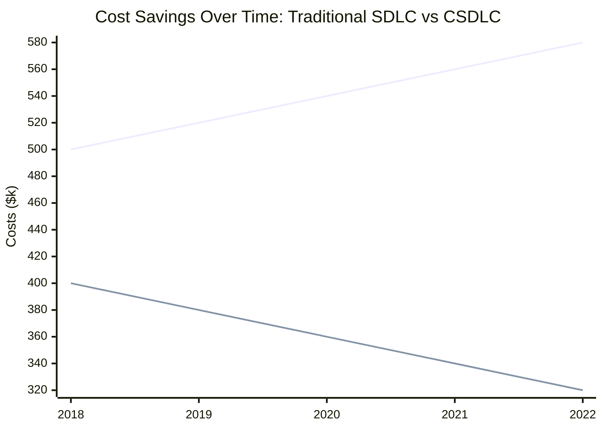

# Evolution of the Software Development Life Cycle (SDLC) and the Role of Cloud Computing

The Software Development Life Cycle (SDLC) is a structured, iterative approach to developing software that addresses past challenges in the industry. The integration of cloud computing has reshaped the SDLC, making it more adaptable and efficient. Understanding this evolution involves exploring the historical "software crisis," the emergence of cloud technologies, and how these advancements have influenced software development.

---

## 🌟 The Software Crisis: A Turning Point

### Origins of the Crisis

The "software crisis" of the 1960s and 1970s highlighted significant challenges in software development. The demand for software solutions grew alongside advances in hardware, but existing methodologies struggled to keep pace. Projects frequently exceeded budgets, missed deadlines, and delivered subpar or incomplete products. Systems often failed to meet user needs, eroding trust in software solutions.

### Causes of the Crisis

Key contributors to the crisis included:

- **Rapid Hardware Evolution**: Hardware improvements demanded more complex software, outpacing developers' abilities.
- **Inefficient Processes**: Early software development lacked systematic methods, leading to chaotic workflows.
- **Inadequate Testing**: Testing was often an afterthought, resulting in poorly functioning products.
- **Communication Gaps**: Developers and end-users often failed to align expectations and requirements.

### Resolution and the Rise of SDLC

The crisis drove the adoption of structured processes, leading to the creation of the SDLC. Its goal was to provide a clear roadmap for projects, ensuring efficiency and alignment with user requirements.

---

## ☁️ The Advent of Cloud Computing

Cloud computing emerged as a transformative force, addressing many of the traditional challenges in software development.

### Historical Context

The roots of cloud computing trace back to the mid-20th century:

1. **1950s**: Time-sharing systems enabled multiple users to access a single computer simultaneously.
2. **1970s**: IBM introduced virtual machines, pioneering resource virtualization.
3. **1990s**: Virtual computers and network-based services laid the groundwork for modern cloud platforms.

### Why Cloud Computing?

Cloud computing revolutionized software development through:

- **Cost Efficiency**: Reducing reliance on physical hardware and minimizing maintenance expenses.
- **Scalability**: Offering the ability to scale resources dynamically based on real-time demand.
- **Flexibility**: Providing ubiquitous access to services via the internet.
- **Performance**: Leveraging advanced infrastructures managed by specialized providers.

### Example:

> **Company X**, a mid-sized e-commerce platform, transitioned its infrastructure to AWS. This move reduced operational costs by 40%, enabled auto-scaling during seasonal traffic spikes, and improved site uptime by 99.9%.

---

## 🛠️ How Cloud Computing Works

Cloud computing’s effectiveness lies in its innovative service delivery model. It relies on several key principles:

1. **Resource Pooling**: Providers use a multi-tenant model, sharing resources across users while maintaining data isolation.
2. **On-Demand Self-Service**: Users can provision resources as needed without requiring manual provider intervention.
3. **Broad Network Access**: Services are accessible globally via standard devices and internet connectivity.
4. **Rapid Elasticity**: Resources can scale up or down in real-time to accommodate fluctuations in demand.
5. **Measured Service**: Transparent resource monitoring ensures accountability and optimal allocation.

---

## 🔄 The Evolution of SDLC with Cloud Computing

The incorporation of cloud computing into SDLC has redefined the software development landscape, giving rise to the **Cloud Software Development Life Cycle (CSDLC)**.

### Key Phases in CSDLC

1. **Cloud Strategy Development**: Organizations identify goals and align cloud capabilities with business objectives.
2. **Planning and Design**: Requirements are mapped to cloud services, ensuring scalability and cost-effectiveness.
3. **Migration and Implementation**: Applications and data are transitioned to the cloud, leveraging automation to streamline the process.
4. **Testing and Optimization**: Cloud-based tools enable faster, more comprehensive testing, ensuring robust performance.
5. **Operations and Maintenance**: Continuous monitoring and updates maximize efficiency while minimizing downtime.

---

## 🌐 Impact of Cloud Computing on SDLC

Cloud computing enhances SDLC in the following ways:

1. **Increased Speed**: Cloud environments enable faster development, testing, and deployment through automation.
2. **Collaboration Efficiency**: Teams can collaborate seamlessly across locations using shared cloud resources.
3. **Cost Savings**: Pay-as-you-go pricing reduces capital expenditure and operational overhead.
4. **Flexibility in Development**: Developers have access to a wide array of tools and services, fostering innovation.
5. **Real-Time Updates**: Continuous integration and delivery pipelines ensure quicker responses to user feedback.

### Example:

> A multinational bank implemented Azure DevOps for continuous integration. This integration reduced deployment times by 50% and enabled real-time testing of updates.

### Financial Impact of CSDLC

---

## 🌟 Takeaways: The Modern SDLC

The SDLC has evolved from addressing the software crisis to becoming a robust framework powered by cloud computing. By integrating cloud technologies, the SDLC now offers unparalleled scalability, cost-efficiency, and user-centricity. The Cloud Software Development Life Cycle represents the cutting edge of software development, ensuring adaptability to dynamic business needs while delivering high-quality solutions.

## 🚀 Next Steps: How to Leverage Cloud Computing

With a clear understanding of how cloud computing enhances the SDLC, the next logical step is exploring practical ways to implement cloud solutions effectively. This involves selecting the right cloud service models (IaaS, PaaS, SaaS), understanding deployment options (public, private, hybrid cloud), and building a roadmap for migration and optimization. The next chapter will delve into these aspects, providing actionable insights and strategies to maximize the benefits of cloud computing in software development.

